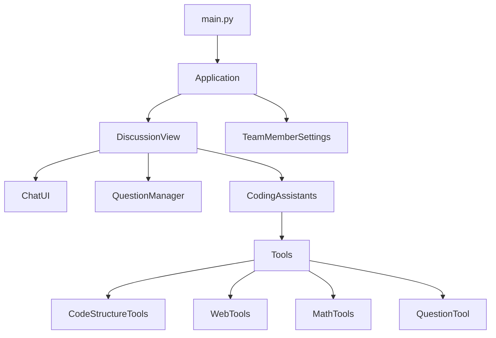
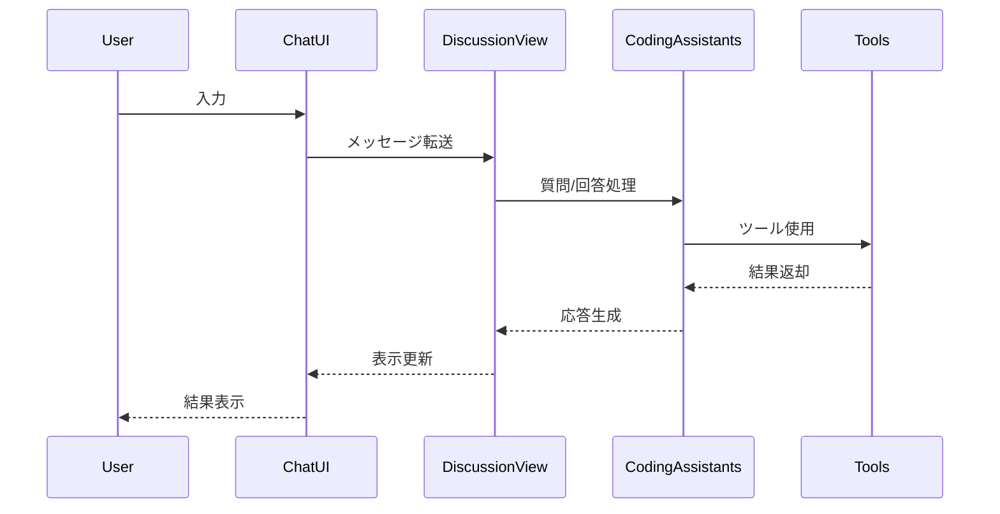

# Arna - Design Document

## アーキテクチャ概要



## コンポーネント構成

### UI層

1. `ChatUI`
   - メッセージの表示
   - 質問と回答の管理
   - Vy風デザインの適用
   - スクロール制御

2. `TeamMemberSettings`
   - エージェント設定
   - API設定
   - モデル選択

### ビジネスロジック層

1. `Application`
   - アプリケーション全体の制御
   - 状態管理
   - ビュー間の連携

2. `DiscussionView`
   - チャット画面の管理
   - 質問フローの制御
   - メッセージ処理

3. `CodingAssistants`
   - AIエージェントの管理
   - チーム編成
   - タスク実行

### ツール層

1. `CodeStructureTools`
   - プロジェクト構造管理
   - YAML形式での保存/読み込み
   - コード生成

2. `WebTools`
   - Web検索
   - スクレイピング

3. `MathTools`
   - 数式計算
   - 方程式解決

4. `QuestionTool`
   - 質問の生成と管理
   - カテゴリ分類
   - 順次表示制御

## データフロー



## 質問フロー

1. エージェントが質問を生成:
```python
{
    "agent_name": "coding_assistant",
    "category": "LIBRARY",
    "content": "どのライブラリを使用しますか？"
}
```

2. UIへの表示:
```
Question 1
From: coding_assistant
Category: LIBRARY
どのライブラリを使用しますか？
```

3. ユーザーの回答:
```
User: Fletを使用します。
```

4. 次の質問に進む

## 設計方針

1. **モジュール性**
   - 各コンポーネントの独立性を保つ
   - インターフェースを明確に定義
   - 依存関係を最小限に

2. **拡張性**
   - 新しいツールの追加が容易
   - カスタムエージェントの追加
   - 質問カテゴリの拡張

3. **ユーザビリティ**
   - 直感的なUI
   - リアルタイムの応答
   - エラー処理とフィードバック

## 今後の展開

1. **機能拡張**
   - コード生成の精度向上
   - より多様なツールの統合
   - チーム構成の最適化

2. **UI改善**
   - アニメーション効果
   - レスポンシブ対応
   - テーマカスタマイズ

3. **パフォーマンス**
   - 非同期処理の最適化
   - キャッシュ機構の導入
   - メモリ使用の効率化
